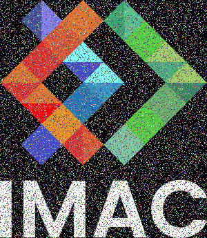
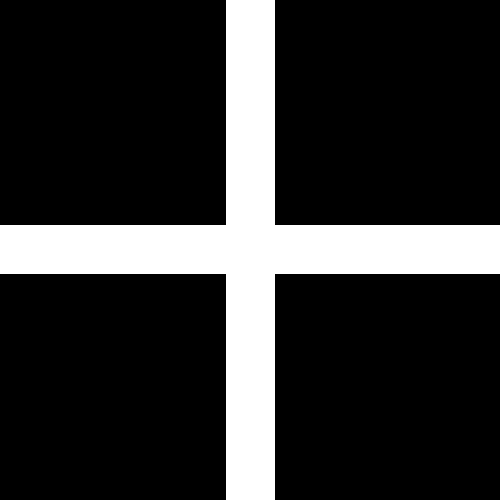
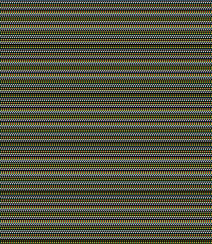
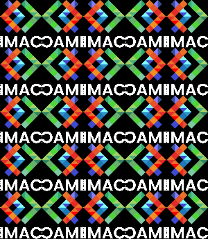
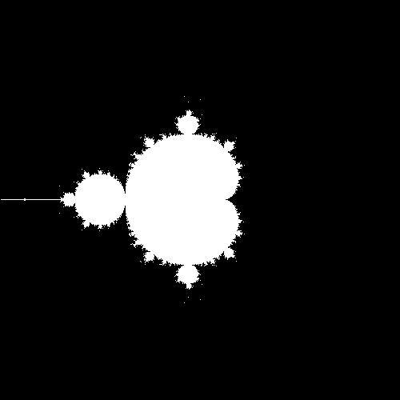
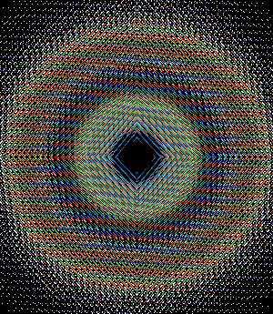

#Rapport du Workshop de programmation
#####Jacquelin Marie
#####Poties Guilhem

<br/>

###Ne garder que le vert ★
</br>

Nous n'avons rencontré aucune difficulté pour ce code.</br>
Pour implémenter cet effet, nous avons mis les canaux bleu et rouge à 0.
</br>

Résultat : 


</br>
</br>

###Echanger les canaux ★

Nous n'avons rencontré aucune difficulté après avoir lu l'indice indiquant d'utiliser la fonction swap</br>
Pour implémenter cet effet, nous avons échanger les couleurs rouge et bleue.
</br>
<details><summary>Code de swap</summary>

```cpp
std::swap(image.pixel(x, y).r, image.pixel(x, y).b);
```
</details>
</br>

Résultat : 

</br>
</br>

###Noir et Blanc ★

Nous avons eu du mal à trouver la formule .</br>
Finalement, on a fait la moyenne des couleurs d'un pixel et on a donné à chacun des canaux la valeur de cette moyenne.
</br>
<details><summary>Code de la moyenne</summary>

```cpp
float moyenneCouleurs = (image.pixel(x,y).r + image.pixel(x,y).g + image.pixel(x,y).b) / 3;
            image.pixel(x,y) = {moyenneCouleurs, moyenneCouleurs, moyenneCouleurs};
```
</details>
</br>

Résultat : 

</br>
</br>

###Négatif ★

Nous n'avons eu aucune difficulté après avoir implémenter l'effet noir et blanc. </br>
Pour chacune des couleurs on a fait 1 - la valeur de cette couleur
</br>

Résultat : 

</br>
</br>

###Miroir ★★

Nous n'avons pas rencontré de difficultés.
Nous avons échanger tous les pixels avec leurs pixels opposés sur l'axe horizontal.

Résultat : 

</br>
</br>

###Image bruitée ★★

Nous n'avons pas rencontré de difficultés.
Nous avons utiliser la fonction random pour que chaque pixel ait une certaine chance d'être changé en une couleur aléatoire.

Résultat : 

</br>
</br>

###Rotation à 90° ★★

Nous avons eu du mal à comprendre qu'il fallait créer une nouvelle image et à comprendre le mécanisme à utiliser pour retourner les pixels (réalisation d'une symétrie avant réussite).
On a aussi dû faire attention à ajouter un -1 pour ne pas dépasser le cadre.
On a donc donner de nouvelles coordonnées à la nouvelle image (qui a des dimensions inversées) à partir des coordonnées de l'image de départ. 

Résultat : 

</br>
</br>

###Split RGB ★★

Nous avons eu des difficultés à comprendre qu'il fallait créer une nouvelle image et comment décaler les pixels sans sortir du cadre.
Dans notre code, chaque pixel sur la nouvelle image regarde, s'il le peut, le rouge sur un pixel qui le précède, le bleu sur un qui le devance et le vert à ses coordonnées actuelles.

Résultat : 

</br>
</br>

###Luminosité ★★

Nous avons eu des difficultés à comprendre sur quoi appliquer la puissance.
On créé deux nouvelles images: sur une on applique une puissance 1/2 sur les paramètre rgb de l'image de départ pour l'éclaicir et sur l'autre une puissance 2 pour l'assombrir.

Résultat : 


</br>
</br>

###Disque ★★

Nous avons eu du mal à trouver la bonne formule pour le cercle.
On colore en blanc les pixels se trouvant à l'intérieur du cercle de rayon r.

Résultat : 

</br>
</br>

###Cercle ★

Nous n'avons pas rencontré de difficulté une fois le disque trouvé.
On a rajouté une condition au code du disque pour colorer les pixels dans le cercle extérieur mais en dehors du cercle intérieur.

Résultat : 

</br>
</br>

###Mosaïque ★★

Nous avons eu du mal à trouver l'emplacement correct du modulo.
Sur une nouvelle image, on prend un pixel sur le nombre de répétition (modulo) pour le recopier et faire n^2 répetitions de l'image en plus pixélisée.

Résultat : 

</br>
</br>

###Mosaïque miroir ★★★

Nous avons trouvé très difficile de gérer l'alternance entre les portions miroirs et le sens de leur inversion.

Résultat : 



###Glitch ★★★

Nous avons trouvé difficile de gérer les nombreuses opérandes simultanément.
Pour cet effet, nous avons créé une boucle, chaque itération correspondant à un glitch, le glitch est représenté par l'échange de deux rectangles dont les positions (gérées par un struct) et les dimensions sont définies aléatoirement à chaque itération.


Résultat : 


###Fractale de Mandelbrot ★★★

Nous avons eu du mal à trouvé comment passer d'un intervalle à l'autre et à comprendre comment faire apparaître les nuances de gris. 


Résultat : 


###Vortex ★★★

Nous avons eu du mal à définir l'angle de rotation par point. 

Résultat : 


###Normalisation de l'histogramme ★★★(★)

Nous avons eu du mal  à trouver la formule correcte de normalisation.

Résultat : 


###Convolutions ★★★★

Nous avons eu du mal à trouver les bonnes conditions des boucles

Résultat : 


###Tri de pixels ★★★★

Nous avons trouvé difficile ai début le fonctionnement de sort puis nous avons bloqué sur une erreur dans les boucles en oubliant de réinitialiser le vecteur à chaque itération.

Résultat : 


